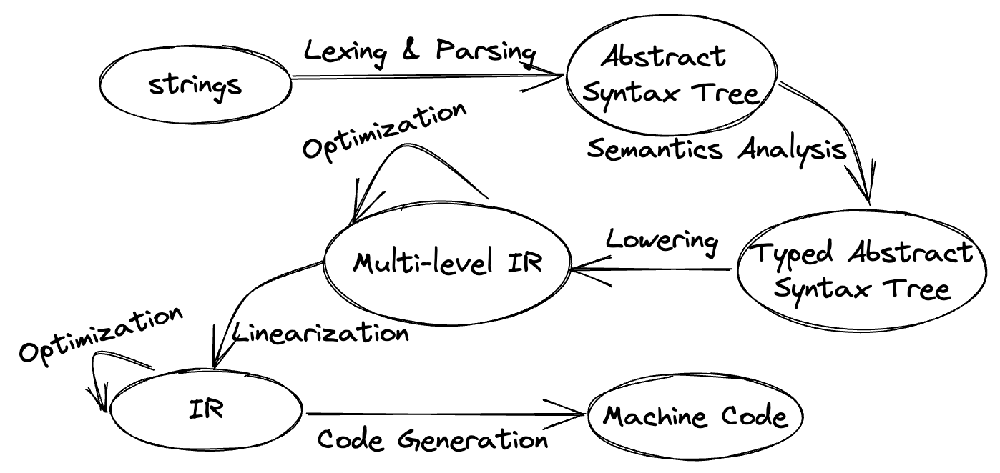
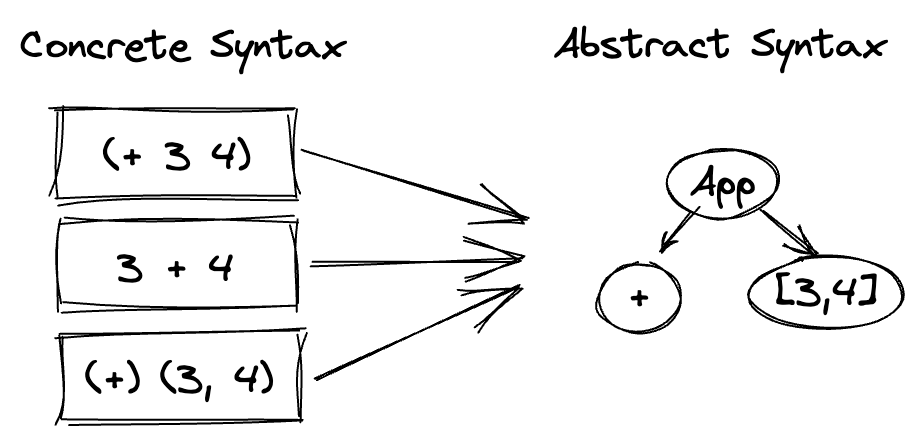
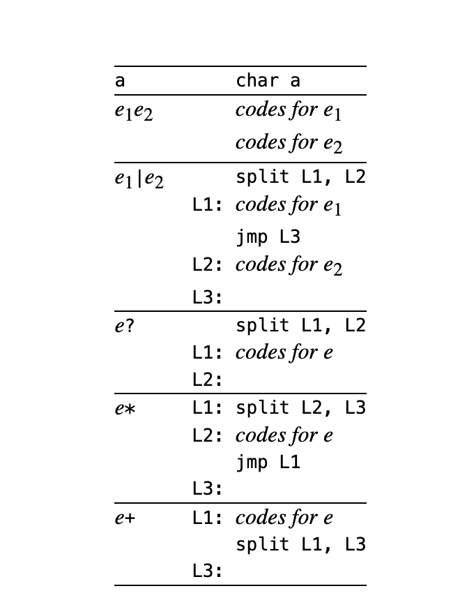

# 基础软件理论与实践公开课 (MoonBit挑战赛辅助教材)

### 张宏波

<!--
欢迎大家来到 张宏波的基础软件理论与实践公开课
今天是周末，非常感谢大家有这个兴趣抽出这个时间来学习

我们预期会持续40分钟到1小时，覆盖内容为第一章的上半部分
 -->

---

# Logistics

- Course website: https://moonbitlang.github.io/minimoonbit-public/
- Discussion forum: https://taolun.moonbitlang.com/
- Target audience:
  - People who are interested in language design and implementations
  - 基于ReScript理论与实践改编，重用了部分内容，新增了一部分高阶内容
- Example code: [MoonBit](https://docs.moonbitlang.com/)
  - Compiles to WASM/JS
  - Great runtime performance
  - Good IDE support and fit for compiler construction
  - No installation required

<!--
关于这门课的社区 微信，CSDN论坛
  - CSDN 主要是用于离线课后讨论
  - 微信群用于实时讨论
这门课的目标受众
  - 主要针对程序语言感兴趣的同学，尽量不设前置条件
  - 但是这门课本身是很有难度的，如果真正理解这门课，是需要大家花不少时间的
这门课会给出代码，代码语言用的是Rescript, 是ML的一种方言，为什么选择这门语言呢
  - 第一方面: 这门语言是我过去大概7年的作品，非常了解， 也是国内程序员主导的第一个在国际有一定影响力的编程语言
  - 另一方面：作为ML的一个方言 本身是非常适合写编译器的 --展开  编译器主要是各种数据结构的互相转换：， 原生抽象语法树的支持 ， 模式匹配等，可以参考这个链接
  - 相比于其他ML语言，安装起来更容易一些，像OCaml很难在Windows上安装
 -->

---

$$
\Huge
\text{MoonBit Programming Challenge}
$$

- Language design and implementation (mini-moonbit in MoonBit) 
- Game Development (Wasm4)
<!-- 我们也常年招聘实习生  -->

---

# Why study compiler&interpreters ?

- It is fun
- Understand your tools you use everyday
- Understand the cost of abstraction
  - Hidden allocation when declaring local functions
  - Why memory leak happens
  - Good system programmers need write a toy C compiler
- Make your own DSLs for profit
- Develop a good taste

<!--
程序语言 本质上是提供各种抽象机制给程序员使用
- 天下没有免费的午餐， compile time cost, runtime cost
- 了解抽象的实现原理，便于我们实现更高效的代码，也理解像javascript某些场景为什么会有内存泄漏
-->

---

# Course Overview

$$
\begin{array} {|c|c|c|c|}
 \text{Lec} & \text{Topic} & \text{Lec} & \text{Topic} \\
 \hline
 0 & \text{Introduction to language design and implementation} & 5  & \text{Stack machine and compilation}\\
 1 & \text{MoonBit crash course} & 6 & \text{IR designs (ANF, CPS)}\\
 2 & \text{Parsing} & 7 & \text{Closure Calculus}\\
 3 & \text{Semantics analysis and type inferences} & 8 & \text{Register allocation \& Garbage collection}\\
 4 & \text{Bidrectional type checking} &  & \\
\end{array}
$$

<!-- 简单介绍下课程章节，这门课程本质是一门实践为主，需要大量的代码帮助大家理解
内容
多 -> 少 （精华)
少 -> 多 各种细节的问题 类似于读书 厚到薄，薄到厚
 -->

---

# Compilation Phases

$\qquad \qquad \qquad$ 

<!--
一般说IR之前属于前端和中端，IDE 在(typed abstract syntax tree)
我们稍后会展开介绍下每个pass
有个误解：前端的工作量不大，主要是早期C语言的影响。现代语言Scala/Rust主要工作都在前端和中端
-->

---

# Compilers, Interpreters

- Compilation and interpretation in two stages
  $\qquad \qquad$ 

- The native compiler has a CPU interpreter

- Interpretation can be done in high level IRs (Python etc)
<!--
我们一般说编译属于离线的 （编译时：compile time), 解释属于在线的(runtime)
本质上任何语言最后都是解释执行的，只是有的语言编译时做的工作多，有的少
 -->

---

# Lexing & Parsing

- From strings to an abstract syntax tree
- Usually split into two phases: tokenization and parsing
- Lots of tool support, e.g.
  - Lex, Yacc, Bison, Menhir, Antlr, TreeSitter, parsing combinators, etc.

$\qquad \qquad \qquad$ 

<!--
大部分工业语言都是手写语法解析的
- Modern langauge design allow an abstract syntax tree to have various concrete syntaxes
-->

---

# Semantic Analysis

- Build the symbol table, resolve variables, modules
- Type checking & inference
  - Check that operations are given values of the right types
  - Infer types when annotation is missing
  - Typeclass/Implicits resolving
  - check other safety/security problems
    - Lifetime analysis
- Type soundness: no runtime type error when type checks
- Reuse code with IDE tooling
<!-- 语义分析是现代语言最复杂的一块，语言设计也要考虑如何在 表达力，可读性，和可分析性方面做个权衡 -->

---

# Language specific lowering, optimizations

- Class/Module/objects/typeclass desugaring
- Pattern match desugaring
- Closure conversion
- Language specific optimizations
- IR relatively rich, MLIR, Direct style, ANF, CPS etc
<!-- * IR forms: Direct style, ANF, CPS, SS -->

---

# Linearization & optimizations

- Language & platform agnostics

- Opimizations
  - Constant folding, propogation, CSE, parital evaluation etc
  - Loop invariant code motion
  - Tail call eliminations
  - Intra-procedural, inter-procedural optimization
- IR simplified: three address code, LLVM IR etc
<!-- 可以做数据流分析 -->

---

# Platform specific code generation

- Instuction selection
- Register allocation
- Instruction scheduling and machine-specific optimization
- Most influential in numeric compuations, DSA
<!-- 优化主要是数值计算比较重要，
性能最大的天花板还是语言一开始设计决定的 很多工业语言Golang, OCaml做的优化并不算多 -->
---

# The smallest practical example: regular language


---

# Regular language compiler 



---

# Regular language VM

- Interpreter (backtracking)
- Optimized interpreter (backtracking with memoization)
- Linearized interpretation
- Compiler (CPU interpreted)

---

# Homework: finish regex compiler and regex VM


---

# Abstract Syntax vs. Concrete Syntax

- Modern language design: no semantic analysis during parsing

  - Counter example: C++ parsing is hard, error message is cryptic

- Many-to-one relation from concrete syntax to abstract syntax
- Start from abstract syntax for this course
  - Tutorials later for parsing in ReScript
  <!-- 语法解析在编译器课程中占比比较多主要是历史原因
      现代语言设计一般会一开始就考虑文法方便机器解析，避免引入太多的歧义
   -->

---

- Tiny Language 0

Concrete syntax

```bnf
 expr :  INT  // 1
      | expr "+" expr // 1 + 2 , (1+2) + 3
      | expr "*" expr // 1 * 2
      | "(" expr ")"
```

Abstract Syntax

```moonbit
enum Expr {
  Cst(Int)
  Add(Expr, Expr)
  Mul(Expr, Expr)
}
```

```java
class Expr {..} class Cst extends Expr {...}
class Add extends Expr {...} class Mul extends Expr{..}
```

<!--
下面是我们第一个小语言
- 我们先看看她的具体语法用bnf形式给出
- 我们再来看看它的抽象语法，抽象语法和具体语法很像，但是有些许简化
对于第一次接触ReScript的人可能有点陌生
`rec` 表示是递归类型(recursive缩写），这个类型定义和BNF是一样的, 只是把中缀改成了前缀
 -->

---

# Interpreter

```moonbit
enum Expr {
  Cst(Int)          // i
  Add(Expr, Expr)   // a + b
  Mul(Expr, Expr)   // a * b
}
```

```moonbit
fn eval(e : Expr) -> Int {
  match e {
    Cst(i) => i
    Add(a, b) => eval(a) + eval(b)
    Mul(a, b) => eval(a) * eval(b)
  }
}
```

<!-- 我们看下这个语言的解释器
`rec` 表示这是一个递归函数。对语法树做case analysis, 这样我们得到了第一个解释器.

这里的例子比较简单，但是要求用户必须理解ReScript才能读懂它的语义，为了便于交流，
数学/逻辑学家们发明了一套数学语言来形式化的描述这个，我们来看一下
-->

---

<!-- # Semantics

* Big-step operational semantics: $e \Downarrow v$
  * easy to understand
  * translate directly to recursive functions
* Small-step operational semantics: $e \rightarrow s_1 \rightarrow \cdots \rightarrow s_n \rightarrow v$
  * fine-grained transition steps and more suitable for reasoning
  * usually defined inductively as a relation between states
* Denotational semantics
  * remove syntactic structures to obtain mathematical objects
  * for better compositionality and interoperability
* Axiomatic semantics, game semantics, etc

We mainly use big-step operational semantics for this course.

--- -->

# Formalization

### Semantics

The evaluation result is a value, which is an integer for our expression language

$$
\begin{align}
& \mathsf{terms}: && e::= \mathsf{Cst}(i) \mid \mathsf{Add}(e_1, e_2) \mid \mathsf{Mul}(e_1, e_2)
\\
& \mathsf{values}: && v ::= i \in \mathsf{Int}
\end{align}
$$

The evaluation rules:

$$
\begin{equation}
  \begin{prooftree}
    \AXC{}\RL{E-const}
    \UIC{$\mathsf{Cst}(i) \Downarrow i$}
  \end{prooftree}
  \qquad
  \begin{prooftree}
    \AXC{$e_1 \Downarrow v_1$}
    \AXC{$e_2 \Downarrow v_2$}
    \RL{E-add}
    \BIC{$\mathsf{Add}(e_1, e_2) \Downarrow (v_1 + v_2)$}
  \end{prooftree}
  \qquad
  \begin{prooftree}
    \AXC{$e_1 \Downarrow v_1$}
    \AXC{$e_2 \Downarrow v_2$}
    \RL{E-mul}
    \BIC{$\mathsf{Mul}(e_1, e_2) \Downarrow (v_1 * v_2)$}
  \end{prooftree}
\end{equation}
$$

<!-- 如果国内的学生第一次看到这种表达， 可能会有很多问题, 但是这个门槛还是要过 这样方便阅读论文，以及和人交流
- 先定义要研究的领域 term, value (展开 ....)
- 往下的箭头表示 一种二元关系，e ｜｜ v 表示e经过很多步计算到v
- 停一下 看下有什么问题
 -->

---

# Inference rules

- The evaluation relation $e \Downarrow v$ means expression $e$ evaluates to value $v$, for example
  - $\mathsf{Cst}(42) \Downarrow 42$
  - $\mathsf{Add}(\mathsf{Cst}(3), \mathsf{Cst}(4)) \Downarrow 7$
- Inference rules provide a concise way of specifying language properties, analyses, etc
  - If the **premises** are true, then the **conclusion** is true
  - An **axiom** is a rule with no premises
  - Inference rules can be **instantiated** by replacing **metavariables** $(e, e_1, e_2, x, i, \cdots)$ with expressions, program variables, integers

---

<!--
我们这里inference rules给出的是一个模版，可以实例化的
-->

# Proof Tree

- Instantiated rules can be combined into proof trees
- $e \Downarrow v$ holds if and only if there is a finite proof tree constructed from correctly instantiated rules, and leaves of the tree are axioms

<!--
这里还有一个概念 叫证明树，我画一个图来帮助大家理解
-->

---

# What is the problem of our interpreter?

<!--
递归调用 不能被汇编直接解释执行，不能被CPU解释执行
本质是临时变量使用了宿主语言的stack
-->

```moonbit
  Add(a, b) => eval(a) + eval(b)
```

---

# Lowering to a stack machine and interpret

```moonbit
enum Instr {
  Cst(Int)
  Add
  Mul
} // non-recursive
typealias Instrs = @immut/list.T[Instr]
typealias Operand = Int
typealias Stack = @immut/list.T[Operand]
```

```moonbit
fn loop_eval(instrs : Instrs, stk : Stack) -> Int {
  loop instrs, stk {
    Cons(Cst(i), rest), stk => continue rest, Cons(i, stk)
    Cons(Add, rest), Cons(a, Cons(b, stk)) => continue rest, Cons(a + b, stk)
    Cons(Mul, rest), Cons(a, Cons(b, stk)) => continue rest, Cons(a * b, stk)
    Nil, Cons(a, _) => a
    _, _ => abort("Matched none")
  }
}
```

<!--
这是我们能看到最简单的虚拟机了
`instr` no rec 已经线性华了
eval 是个尾递归 实际上是个循环，可以很容易写成一个while loop 和第一种解释不太一样
-->

---

### Semantics

The machine has two components:

- a code pointer $c$ giving the next instruction to execute
- a stack $s$ holding intermediate results

Notation for stack: top of stack is on the left

$$
\begin{gather}
s \rightarrow v\mathrel{::}s \qquad (\text{push } v \text{ on } s)\\
v\mathrel{::}s \rightarrow s \qquad (\text{pop } v \text{ off } s)
\end{gather}
$$

<!-- 这里有两个数据结构  一个是指令 也就是代码，静态不可变的，另一个是栈，是动态的 -->

<!-- | **Instructions** | **Stack before** | **Stack after** | **Effect** | -->
<!-- |------------------|------------------|-----------------|------------| -->
<!-- | $\mathsf{Cst(i)}$ | $s$ | $\Rightarrow s, i$ | Push constant | -->
<!-- | $\mathsf{Add}$ | $s,i_1,i_2$ | $\Rightarrow s, (i_1+i_2)$ | Addition | -->
<!-- | $\mathsf{Mul}$ | $s,i_1,i_2$ | $\Rightarrow s, (i_1\times i_2)$ | Multiplication | -->

---

# Transition of Stack Machine

Code and stack:

$$
\begin{align}
& \mathsf{code}: && c::= \epsilon \mid i\mathrel{;} c\\
& \mathsf{stack}: && s ::= \epsilon \mid v \mathrel{::} s
\end{align}
$$

Transition of the machine:

$$
\begin{align}
(\text{Cst}(i);c, s) & \rightarrow (c, i::s) && \text{(I-Cst)}\\
(\text{Add};c, n_2::n_1::s) & \rightarrow (c, (n_1+n_2)::s) && \text{(I-Add)}\\
(\text{Mul};c, n_2::n_1::s) & \rightarrow (c, (n_1\times n_2)::s) && \text{(I-Mul)}\\
\end{align}
$$

The execution of a sequence of instructions terminates when the code pointer reaches the end and returns the value on the top of the stack

$$
\begin{prooftree}
\AXC{$(c,\epsilon) \rightarrow^* (\epsilon, v\mathrel{::}\epsilon)$}
\UIC{$c \downarrow v$}
\end{prooftree}
$$

<!-- small step semantics
-->

---

# Formalization

The compilation corresponds to the following mathematical formalization.

$$
\newcommand{\ll}{\left[\!\left[}
\newcommand{\rr}{\right]\!\right]}
\begin{align}
\ll \mathsf{Cst}(i) \rr & = \text{Cst}(i)\\
\ll \mathsf{Add(e_1, e_2)} \rr & = \ll e_1 \rr \mathrel{;} \ll e_2 \rr \mathrel{;} \text{Add}\\
\ll \mathsf{Mul(e_1, e_2)} \rr & = \ll e_1 \rr \mathrel{;} \ll e_2 \rr \mathrel{;} \text{Mul}
\end{align}
$$

- $\ll \cdots \rr$ is a commonly used notation for compilation
- Invariant: stack balanced property
- Proof by induction (machine checked proof using Coq)

<!--
我们解释了刚才的一个虚拟机，他的形式化的语义和非形式化的语义，现在我们讲下如何来编译我们定义的高级语言到这个低级语言上
栈平衡时个非常重要的性质 [e] leave the output on top of the stack
数学归纳法来证明
-->

---

# Compilation

- The evaluation $\mathsf{expr}$ language implicitly uses the stack of the host language
- The stack machine manipulates the stack explicitly

### Correctness of Compilation

A correct implementation of the compiler preserves the semantics in the following sense

$$
e \Downarrow v \Longleftrightarrow \ll e \rr \downarrow v
$$

---

# Homework

Implement the compilation algorithm 

<!--

第一堂课到此结束
-->

---

# Tiny Language 1

### Abstract Syntax: add names

```moonbit
enum Expr {
  ...
  Var(String)
  Let(String, Expr, Expr)
}
```

<!-- 回忆一下tiny language 0, 它的抽象能力是远远不够的

比如 Add(Add(Cst 2, Cst 2), Add(Cst 2, Cst 2)))
需要给重复的计算一个名字以便重用，这便是一种抽象
抽象要设计的合理: Let的作用域只在第二个表达式中
那么这个语言如何解释呢， 涉及到一个寻址的问题，Var的定义离使用是可以很远的
-->

---

# Interpreter

### Semantics with Environment

```moonbit
type Env @immut/list.T[(String, Int)]
fn eval(expr : Expr, env : Env) -> Int {
  match (expr, env) {
    (Cst(i), _) => i
    (Add(a, b), _) => eval(a, env) + eval(b, env)
    (Mul(a, b), _) => eval(a, env) * eval(b, env)
    (Var(x), Env(env)) => assoc(x, env).unwrap()
    (Let(x, e1, e2), Env(env)) => eval(e2, Cons((x, eval(e1, env)), env))
  }
}
```

<!--  不同于临时变量 ， 我们的名字是有可能在一个很遥远的地方被使用的 需要引入一种寻址模式
这里我们使用 链表，assoc的方式来寻址

每个变量名不一样的话 显然是对的
举个例子说一下shadow的情况 -- Let(x,e1,e2) e1 里面也有x的话会是如何，Let (x, Let(x, 1, Add(x,x)), Add(x,x))

好那我们来看下它形式化的语义
-->

---

# Formalization

$$
\begin{align}
& \mathsf{terms}: && e::= \mathsf{Cst}(i) \mid \mathsf{Add}(e_1, e_2) \mid \mathsf{Mul}(e_1, e_2)
\mid \mathsf{Var}(i) \mid \mathsf{Let}(x, e_1, e_2)
\\
& \mathsf{envs}: && \Gamma ::= \epsilon \mid (x, v) \mathrel{::} \Gamma
\end{align}
$$

Notations for the environment:

$$
\text{variable access: }\Gamma[x] \qquad \text{variable update: } \Gamma[x:=v]
$$

The evaluation rules:

$$
\begin{gather}
  \begin{prooftree}
    \AXC{}\RL{E-const}
    \UIC{$\Gamma \vdash \mathsf{Cst}(i) \Downarrow i$}
  \end{prooftree}
  \qquad
  \begin{prooftree}
    \AXC{$\Gamma \vdash e_1 \Downarrow v_1$}
    \AXC{$\Gamma \vdash e_2 \Downarrow v_2$}
    \RL{E-add}
    \BIC{$\Gamma \vdash \mathsf{Add}(e_1, e_2) \Downarrow (v_1 + v_2)$}
  \end{prooftree}
  \qquad
  \begin{prooftree}
    \AXC{$\Gamma \vdash e_1 \Downarrow v_1$}
    \AXC{$\Gamma \vdash e_2 \Downarrow v_2$}
    \RL{E-mul}
    \BIC{$\Gamma \vdash \mathsf{Mul}(e_1, e_2) \Downarrow (v_1 * v_2)$}
  \end{prooftree}
  \\[1em]
  \begin{prooftree}
    \AXC{$\Gamma[x] = v$}
    \RL{E-var}
    \UIC{$\Gamma \vdash \mathsf{Var}(x) \Downarrow v$}
  \end{prooftree}
  \qquad
  \begin{prooftree}
    \AXC{$\Gamma \vdash e_1 \Downarrow v_1$}
    \AXC{$\Gamma[x := v_1] \vdash e_2 \Downarrow v$}
    \RL{E-let}
    \BIC{$\Gamma \vdash \mathsf{Let}(x, e_1, e_2) \Downarrow v$}
  \end{prooftree}
\end{gather}
$$

<!-- 这里的计算关系是个三元关系，可以用前缀来表示，但是逻辑学家们喜欢用这种符号来表示
-- 过一下每个规则。
这个关系是算法制导的， 每一个下面的结论只有一种反向的对应的。
-->

---

# What's the problem in our evaluator

- Where is the redundant work and can be resolved in compile time?
- The length of variable name affect our runtime performance!!

## <!-- 寻址太浪费时间了， 我们希望尽可能在编译的时候多做点工作 可以画个图-->

---

# Tiny Language 2

The position of a variable in the list is its binding depth (index)

```moonbit
enum ExprNameless {
  ...
  Var(Int)
  Let(Expr, Expr)
}
```

<!--
这里解释下ReScript, module的意思：简单的理解， 创建一个作用域，这样避免和Tiny language 1起冲突
Let 隐世的在栈里面push 一个变量 ， 举个具体的例子-->

---

# Semantics

### Evaluation function

```moonbit
type Env @immut/list.T[Int]
fn eval(e : ExprNameless, env : Env) -> Int {
  match e {
    Cst(i) => i
    Add(a, b) => eval(a, env) + eval(b, env)
    Mul(a, b) => eval(a, env) * eval(b, env)
    Var(n) => env.0.nth(n).unwrap()
    Let(e1, e2) => eval(e2, Cons(eval(e1, env), env.0))
  }
}
```

## <!-- 和前面的带名字的一样 只是寻址加快了,并且复杂度和变量名的长度无关，局部变量成功的用个栈来进行存储 -->

---

# Semantics

Terms and values are the same.
Environments become sequence of values $v_1 \mathrel{::} v_2 \mathrel{::} \cdots \mathrel{::} \epsilon$, accessed by position $s[n]$

$$
\begin{align}
& \mathsf{envs}: && s ::= \epsilon \mid v \mathrel{::} s
\end{align}
$$

Evaluation rules:

$$
\begin{gather}
  \begin{prooftree}
    \AXC{}\RL{E-const}
    \UIC{$s \vdash \mathsf{Cst}(i) \Downarrow i$}
  \end{prooftree}
  \qquad
  \begin{prooftree}
    \AXC{$s \vdash e_1 \Downarrow v_1$}
    \AXC{$s \vdash e_2 \Downarrow v_2$}
    \RL{E-add}
    \BIC{$s \vdash \mathsf{Add}(e_1, e_2) \Downarrow (v_1 + v_2)$}
  \end{prooftree}
  \qquad
  \begin{prooftree}
    \AXC{$s \vdash e_1 \Downarrow v_1$}
    \AXC{$s \vdash e_2 \Downarrow v_2$}
    \RL{E-mul}
    \BIC{$s \vdash \mathsf{Mul}(e_1, e_2) \Downarrow (v_1 * v_2)$}
  \end{prooftree}
  \\[1em]
  \begin{prooftree}
    \AXC{$s[i] = v$}
    \RL{E-var}
    \UIC{$s \vdash \mathsf{Var}(i) \Downarrow v$}
  \end{prooftree}
  \qquad
  \begin{prooftree}
    \AXC{$s \vdash e_1 \Downarrow v_1$}
    \AXC{$v_1 \mathrel{::} s  \vdash e_2 \Downarrow v$}
    \RL{E-let}
    \BIC{$s \vdash \mathsf{Let}(x, e_1, e_2) \Downarrow v$}
  \end{prooftree}
\end{gather}
$$

## <!-- 形式化的语义和带名字的几乎一样，还是三元关系， 只是环境的编码变了 -->

---

# Explanation

- The evaluation environment $\Gamma$ for $\mathsf{expr}$ contains both names and values
- The evaluation environment $s$ for $\mathsf{Nameless.expr}$ only contains the values, indexes resolved at compile time

### Lowering $\mathsf{expr}$ to $\mathsf{Nameless.expr}$

```moonbit
type Cenv @immut/list.T[String]
fn comp(e : Expr, cenv : Cenv) -> ExprNameless {
  match e {
    Cst(i) => Cst(i)
    Add(a, b) => Add(comp(a, cenv), comp(b, cenv))
    Mul(a, b) => Mul(comp(a, cenv), comp(b, cenv))
    Var(x) => Var(index(cenv.0, x).unwrap())
    Let(x, e1, e2) => Let(comp(e1, cenv), comp(e2, Cons(x, cenv.0)))
  }
}
```

<!--
cenv是完全静态的编译时的环境
这个可以理解为 partial evaluation,  只对静态的 部分进行预计算
那么如何编译这个Nameless.expr到我们的虚拟机呢
 -->

---

# Next: add new instructions to our VM to support the new langauge features 
 
---
# Compile $\mathsf{Nameless.expr}$

```moonbit
enum Instr {
  ...
  Var(Int)
  Pop
  Swap
}
```

Semantics of the new instructions

$$
\newcommand{\Pop}{\mathsf{Pop}}
\newcommand{\Swap}{\mathsf{Swap}}
\newcommand{\Cst}{\mathsf{Cst}}

\begin{align}
(\text{Var}(i);c, s) & \rightarrow (c, s[i]::s) && \text{(I-Var)}\\
(\text{Pop};c, n::s) & \rightarrow (c, s) && \text{(I-Pop)}\\
(\text{Swap};c, n_1\mathrel{::}n_2::s) & \rightarrow (c, n_2::n_1::s) && \text{(I-Swap)}\\
\end{align}
$$

where $s[i]$ reads the $i$-th value from the top of the stack

<!-- 我们注意到由于我们引入了 变量名，在栈是虚拟机也必须引入一个对应的寻址方式
寻址方式有很多种，我们引入一个最简单的，从栈顶往下数

同时注意我们之前讲述的 栈平衡性质  `Let (x,x,x) `
-->

---

# Stack Machine with Variables

The program: $\newcommand{\Let}{\mathsf{Let}}\newcommand{\Var}{\mathsf{Var}}\newcommand{\CstI}{\mathsf{CstI}}\newcommand{\Add}{\mathsf{Add}}\newcommand{\Mul}{\mathsf{Mul}}\qquad \qquad \Let(x, \CstI(17), \Add(\Var(x), \Var(x)))$

is compiled to instructions:

$$
[ \Cst(17); \Var(0); {\color{red}\Var(1)}; \Add; \Swap; \Pop ]
$$

The execution on the stack:
$\qquad \quad$ 

<!-- 为了帮助大家的理解 我们举个例子-->

---

# More examples

Consider the following program

```moonbit
let x = 2
1 + (x + 7)
```

is compiled to instructions

$$
[ \Cst(1); \Cst(2); \Var(0); \Cst(7); \Add; \Swap; \Pop; \Add ]
$$

The execution on the stack:
$\quad$ 

---

# Summary 1

What have we achieved through compilation? Compare the runtime environment

- Evaluating $\mathsf{expr}$
  - a symbolic environment $\Gamma$ for local variables
  - (implicit) stack of the host language for temperaries
- Evaluating $\mathsf{Nameless.expr}$
  - a stack for local variables
  - (implicit) stack of the host language for temperaries
- For stack machine instructions, we have
  - a stack for both local variables and temperaries

## <!-- -->

---

# Summary 2

$\qquad \qquad \qquad$ 

### Homework 

- Write an interpreter for the stack machine with variables
- Write a compiler to translate $\mathsf{Nameless.expr}$ to stack machine instructions
- Implement the dashed part (one language + two compilers)

<!-- ### Semantics with Substitution -->
<!-- we add the following new evaluation rules to the semantics -->
<!-- $$ -->
<!-- \begin{equation} -->
<!--   \begin{prooftree} -->
<!--     \AXC{}\RL{var} -->
<!--     \UIC{$\mathsf{Var}(x) \unicode{x21af}$} -->
<!--   \end{prooftree}   -->
<!--   \qquad -->
<!--   \begin{prooftree} -->
<!--     % \AXC{$e \Downarrow v_x$} -->
<!--     \AXC{$e_2[e_1/x] \Downarrow v$} -->
<!--     \RL{let} -->
<!--     \UIC{$\mathsf{Let}(x, e_1, e_2) \Downarrow v$} -->
<!--   \end{prooftree} -->
<!-- \end{equation} -->
<!-- $$ -->

<!-- --- -->

<!-- # Free Variables and Substitution -->

<!-- ### Free variables -->

<!-- ### Substitution -->

<!-- $$ -->
<!-- \begin{align*} -->
<!-- \mathsf{Cst}(i)[e/x] & = \mathsf{Cst}(i)\\ -->
<!-- \mathsf{Prim}(op, e_1, \cdots, e_n)[e/x] & = \mathsf{Prim}(op, e_1[e/x], \cdots, e_n[e/x])\\ -->
<!-- \mathsf{Var}(x)[e/x] & = e\\ -->
<!-- \mathsf{Var}(y)[e/x] & = \mathsf{Var}(y) \quad \text{assuming}\ x \neq y\\ -->
<!-- \mathsf{Let}(x, e_1, e_2)[e/x] & = \mathsf{Let}(x, e_1, e_2)\\ -->
<!-- \mathsf{Let}(y, e_1, e_2)[e/x] & = \mathsf{Let}(y, e_1[e/x], e_2[e/x]) \quad \text{assuming}\ x \neq y -->
<!-- \end{align*} -->
<!-- $$ -->

<!-- --- -->
<!-- # Semantics -->

<!-- * Substitution traverses over epxression and replaces variable with expression -->
<!-- * Then evaluation traverses over expression -->
<!-- * So $e_2[e_1/x] \Downarrow v$ is not very efficient -->
<!-- * Why not do substitution at the same time as we do evaluation? -->
<!-- * Modify $\mathsf{eval}$ to use an **environment**: a map from variables to the values -->

<!--

# Question

* It is obvious we need the $\Var(n)$ instruction to reference variables on the stack
* But why do we need the $\Swap$ and $\Pop$ instructions?
-->
